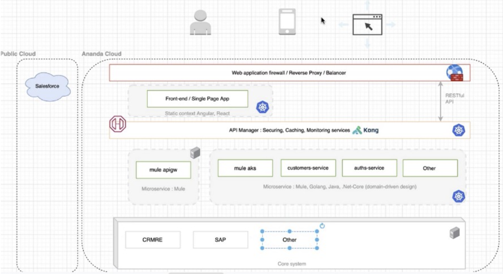

# Existing Infrastructure and requirement recap

The existing infrastructure (architecture) have application deployed into AKS cluster, however the authentication/authorization
is handled by Opensource component (Key Cloak).

 

 

The current API gateway using `Kong` running in kubernetes cluster

**Pain Points**
- Lack of access log (request/response), make it difficault to investigate
- Performance problem between token validation process (done by `Kong` and `KeyCloak`)
- Don't have access control to private APIs

**Requirements**
- Introduce Azure API Management (APIM) to be API gateway between client and backend service
- APIM should provide access log message (request/response) for the investigation 
- Use APIM to control some set of APIs which will be accessed within internal service, these set of API should not be available to public, with `Product` feature
- Support `OAuth 2.0` (with Azure Active Directory)
- Security between APIM and backend service (`mTLS` and IP whitelist )
- Using Azure KeyVault to store credential
- Using GitHub Action as CICD 
- Using ACR as container registry